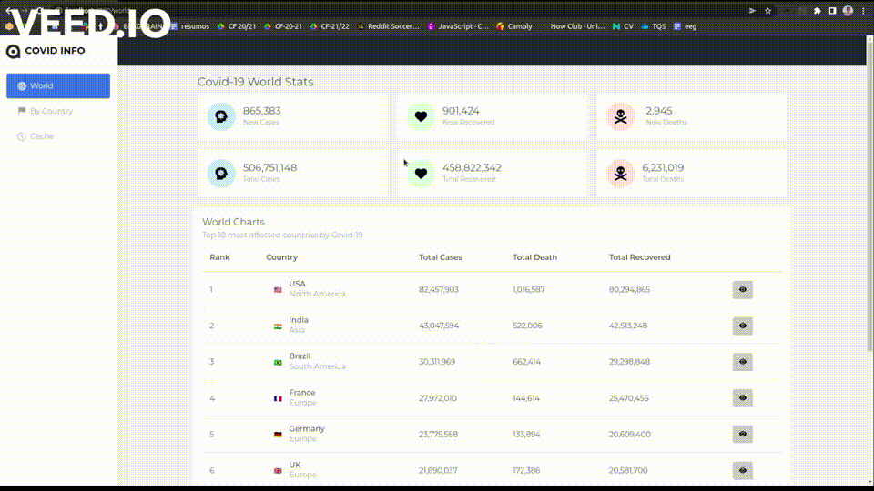

## **HW1: Mid-term Assignment**

### **1. Objective**

Develop a multi-layer web application, in Spring Boot, supplied with automated tests.

<br>

### **2. Project scope**

This application provides details about COVID-19 incidence data worldwide and for a given country/territory.

<br>

### **3. Demonstration**

<br>



>> Full demonstration [here](https://www.youtube.com/watch?v=w-xc9dv0mkA)

<br>

### **4. Technologies stack**

| Component | Tecnology |
| :---: | :---: |
| frontend | Angular |  
| backend| Spring Boot | 
| API | [VACCOVID - coronavirus, vaccine and treatment tracker](https://rapidapi.com/vaccovidlive-vaccovidlive-default/api/vaccovid-coronavirus-vaccine-and-treatment-tracker/) | 

<br>

### **5. How to run**

```
# in the root folder (HW1)

cd backend/covid
./mvnw spring-boot:run


# in another terminal in the root folder (HW1)

cd frontend/covid
ng serve
```

<br>

### **6. How to run tests**

```
# before run the test, configure the path of ChromeWebDriver file

PATH=$(getconf PATH)
echo 'export PATH=$PATH:/home/joao/Transferências' >> ~/.bash_profile
source ~/.bash_profile
```

```
mvn clean test

# with jacoco report

mvn clean jacoco:prepare-agent install jacoco:report

```
<br>

### **7. Authors**

João Reis, 98474 <br>
github: [joaoreis16](https://github.com/joaoreis16)

<br>
<br>
Testes e Qualidade de Software
<br>
Universidade de Aveiro, 2021

